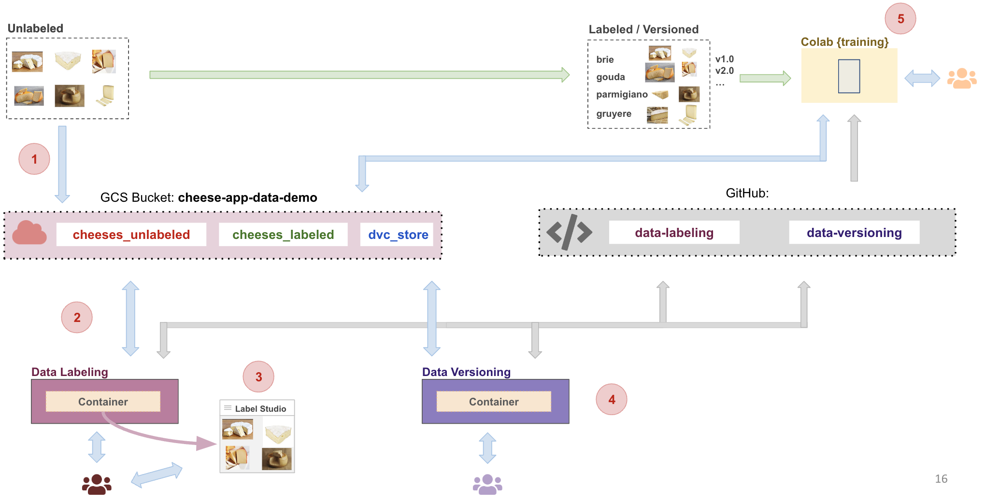
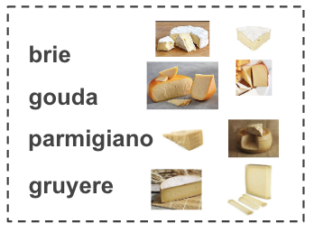

# Tutorial (T6) Cheese App: Data Labeling AWS 

In this tutorial we will build a data pipeline flow as shown:


## Prerequisites
* Have Docker installed
* Cloned this repository to your local machine https://github.com/dlops-io/data-labeling-aws

#### Ensure Docker Memory
- To make sure we can run multiple container go to Docker>Preferences>Resources and in "Memory" make sure you have selected > 4GB

## Cheese App: Data Labeling
In this tutorial we will setup a data labeling web app to label data for the cheese app. We will use Docker to run everything inside containers.

**In order to complete this tutorial you will need your own GCP account setup and your github repo.**
### Fork the github repository
- Fork or download from [here](https://github.com/dlops-io/data-labeling-aws)


## Setup AWS Credentials
Next step is to enable our container to have access to AWS Storage buckets. 

### Create a local **secrets** folder

It is important to note that we do not want any secure information in Git. So we will manage these files outside of the git folder. At the same level as the `data-labeling-aws` folder create a folder called **secrets**

Your folder structure should look like this:
```
   |-data-labeling-aws
   |-secrets
```

### Setup AWS IAM User for accessing S3 Bucket
- Go to the AWS Management Console
- Navigate to IAM (Identity and Access Management)
- Click on "Users" in the left sidebar, then "Add user"
- Choose a username 
- Set Permissions:
  - Attach policies directly 
  - We are going to select "AmazonS3FullAccess" 
- Create Access Keys
    - Select "Local Code"
    - After creating the user, you'll see a page with the Access Key ID and Secret Access Key
    - Download these credentials into the **secrets** folder


### Create docker-shell.sh and .env file
- We also setup AWS credentials in the .env file
- Create a file called `docker-shell.sh`
```
#!/bin/bash

set -e
CSV_FILE="../secrets/s3bucket_programmatic_access_accessKeys.csv"

# Check if the file exists and is readable
if [ ! -r "$CSV_FILE" ]; then
    echo "Error: Cannot read $CSV_FILE. Check if it exists and has correct permissions."
    exit 1
fi

# Create the .env file
AWS_ACCESS_KEY_ID=$(awk -F ',' 'NR==2 {print $1}' "$CSV_FILE")
AWS_SECRET_ACCESS_KEY=$(awk -F ',' 'NR==2 {print $2}' "$CSV_FILE")

echo "AWS_ACCESS_KEY_ID=$AWS_ACCESS_KEY_ID" > .env
echo "AWS_SECRET_ACCESS_KEY=$AWS_SECRET_ACCESS_KEY" >> .env

# Source the .env file
source .env

# Create the network if we don't have it yet
docker network inspect data-labeling-network >/dev/null 2>&1 || docker network create data-labeling-network

# Build the image based on the Dockerfile
docker build -t data-label-cli -f Dockerfile .

# Run All Containers
docker-compose run --rm --service-ports data-label-cli
```


- Create a file called `docker-compose.yml`

```
version: "3.8"
networks:
    default:
        name: data-labeling-network
        external: true
services:
    data-label-cli:
        image: data-label-cli
        container_name: data-label-cli
        volumes:
            - ../secrets:/secrets
            - ../data-labeling:/app
        environment:
            AWS_ACCESS_KEY_ID: ${AWS_ACCESS_KEY_ID}
            AWS_SECRET_ACCESS_KEY: ${AWS_SECRET_ACCESS_KEY}
            AWS_REGION: "us-east-1"
            AWS_S3_BUCKET_NAME: "cheese-app-data-demo"
            LABEL_STUDIO_URL: "http://data-label-studio:8080"
        depends_on:
            - data-label-studio
        
    data-label-studio:
        image: heartexlabs/label-studio:latest
        container_name: data-label-studio
        ports:
            - 8080:8080
        volumes:
            - ./docker-volumes/label-studio:/label-studio/data
            - ../secrets:/secrets
        environment:
            LABEL_STUDIO_DISABLE_SIGNUP_WITHOUT_LINK: "true"
            LABEL_STUDIO_USERNAME: "pavlos@seas.harvard.edu"
            LABEL_STUDIO_PASSWORD: "awesome"
            AWS_ACCESS_KEY_ID: ${AWS_ACCESS_KEY_ID}
            AWS_SECRET_ACCESS_KEY: ${AWS_SECRET_ACCESS_KEY}
            AWS_REGION: "us-east-1"

```

## Prepare Dataset
In this step we will assume we have already collected some data for the cheese app. The images are of various cheeses belonging to either `brie`, `gouda`, `gruyere`, `parmigiano` type. None of the images are labeled and our task here is to use label studio to manage labeling of images.

### Download data
- Download the unlabeled data from [here](https://github.com/dlops-io/datasets/releases/download/v4.0/cheeses_unlabeled.zip)
- Extract the zip file

### Create AWS S3 Bucket
- Go to `https://us-east-1.console.aws.amazon.com/s3/home?region=us-east-1`
- Create a bucket `cheese-app-data-demo` (REPLACE WITH YOUR BUCKET NAME)
- Create a folder `cheeses_unlabeled` inside the bucket
- Create a folder `cheeses_labeled` inside the bucket

### Upload data to Bucket
- Upload the images from your local folder into the folder `cheeses_unlabeled` inside the bucket

## Run Label Studio Container

### Run `docker-shell.sh` or `docker-shell.bat`
Based on your OS, run the startup script to make building & running the container easy

- Make sure you are inside the `data-labeling` folder and open a terminal at this location
- Run `sh docker-shell.sh` or `docker-shell.bat` for windows

This will run two container. The label studio container and a CLI container that can call API's to label studio. You can verify them by running `docker container ls` on another terminal prompt. You should see something like this:
```
CONTAINER ID   IMAGE                             COMMAND                  CREATED         STATUS         PORTS                    NAMES
9f6ffae30b59   data-label-cli                    "pipenv shell"           9 seconds ago   Up 9 seconds                            data-labeling-data-label-cli-run-4aeb0a7fa4ec
ebd6f1647f07   heartexlabs/label-studio:latest   "./deploy/docker-ent…"   7 hours ago     Up 7 hours     0.0.0.0:8080->8080/tcp   data-label-studio

```


## Setup Label Studio

### Create Annotation Project
Here we will setup the Label Studio App to user our cheese images so we can annotate them. 
- Run the Label Studio App by going to `http://localhost:8080/`
- Login with `pavlos@seas.harvard.edu` / `awesome`, use the credentials in the docker compose file that you used
- Click `Create Project` to create a new project
- Give it a project name
- Skip `Data Import` tab and go to `Labeling Setup`
- Select Template: Computer Vision > Image Classification
- Remove the default label choices and add: `brie`, `gouda`, `gruyere`, `parmigiano`
- Save

### Configure Cloud Storage
Next we will configure Label Studio to read images from a S3 bucket and save annotations to a S3 bucket
- Go the project created in the previous step
- Click on `Settings` and select `Cloud Storage` on the left options
- Click `Add Source Storage`
- Then in the popup for storage details:
    - Storage Type: `AWS S3`
    - Storage Title: `Cheese Images`
    - Bucket Name: `cheese-app-data-demo` (REPLACE WITH YOUR BUCKET NAME)
    - Bucket Prefix: `cheeses_unlabeled`
    - File Filter Regex: `.*`
    - Select your region
    - AWS Access Key ID: `YOUR_AWS_ACCESS_KEY_ID`
    - AWS Secret Access Key: `YOUR_AWS_SECRET_ACCESS_KEY`
    - Ignore: Session Token
    - Enable: Treat every bucket object as a source file
    - Enable: Use pre-signed URLs
- You can `Check Connection` to make sure your connection works
- `Save` your changes
- Click `Sync Storage` to start syncing from the bucket to label studio
- Click `Add Target Storage`
- Then in the popup for storage details:
    - Storage Type: `AWS S3`
    - Storage Title: `Cheese Images`
    - Bucket Name: `cheese-app-data-demo` (REPLACE WITH YOUR BUCKET NAME)
    - Bucket Prefix: `cheeses_labeled`
    - AWS Region: `YOUR_AWS_REGION`
    - AWS Access Key ID: `YOUR_AWS_ACCESS_KEY_ID`
    - AWS Secret Access Key: `YOUR_AWS_SECRET_ACCESS_KEY`
    - Ignore: Session Token
    - Ignore: S3 Endpoint
    - Ignore: SSE KMS Key ID
- You can `Check Connection` to make sure your connection works
- `Save` your changes

### Enable cross-origin resource sharing (CORS)
- See here for what is CORS: https://chatgpt.com/share/b7f01269-2f57-4214-a431-d9012bdc0134

In order to view images in Label studio directly from S3 Bucket, we need to enable CORS
- Go to the shell where we ran the docker containers
- Run `python cli.py -c`
- To view the CORs settings, run `python cli.py -m`
- To view all the code open `data-labeling` folder in VSCode or any IDE of choice

OR 

You can also do this manually in the AWS S3 bucket console - Go to the bucket -> Permissions -> CORS-> Add the following CORS configuration:
```
[
    {
        "AllowedHeaders": [
            "*"
        ],
        "AllowedMethods": [
            "GET"
        ],
        "AllowedOrigins": [
            "*"
        ],
        "ExposeHeaders": [
            "x-amz-server-side-encryption",
            "x-amz-request-id",
            "x-amz-id-2"
        ],
        "MaxAgeSeconds": 3000
    }
]
```

### Annotate Data
Go into the newly create project and you should see the images automatically pulled in from the S3 Bucket
- Click on an item in the grid to annotate using the UI
- Repeat for a few of the images

Here are some examples of cheeses and their labels:


### View Annotations in S3 Bucket
- Go to `https://us-east-1.console.aws.amazon.com/s3/home?region=us-east-1`
- Go into the `cheese-app-data-demo` (REPLACE WITH YOUR BUCKET NAME) and then into the folder `cheeses_labeled`
- You should see some json files corresponding to the images in the `cheeses_unlabeled` that have been annotated
- Open a json file to see what the annotations look like


### View Annotations using CLI
- Get the API key from Label studio for programatic access to data
- Go to User Profile > Account & Settings
- You can copy the Access Token from this screen
- Use this token as the -k argument in the following command line calls
- Go to the shell where ran the docker containers
- Run `python cli.py -p -k` followed by your Access Token. This will list out your projects
- Run `python cli.py -t -k` followed by your Access Token. This will list some tasks from the first project

You will see the some json output of the annotations for each image that is being stored in Label Studio
```
Number of tasks: 21
Number of labeled tasks: 6
Annotations: [{'id': 1, 'result': [{'value': {'choices': ['brie']}, 'id': 'mIjONl1Su4', 'from_name': 'choice', 'to_name': 'image', 'type': 'choices', 'origin': 'manual'}], 'created_username': ' pavlos@seas.harvard.edu, 1', 'created_ago': '9\xa0hours, 58\xa0minutes', 'completed_by': 1, 'was_cancelled': False, 'ground_truth': False, 'created_at': '2024-09-11T15:30:40.969779Z', 'updated_at': '2024-09-11T15:30:40.969800Z', 'draft_created_at': None, 'lead_time': 5.198, 'import_id': None, 'last_action': None, 'task': 1, 'project': 1, 'updated_by': 1, 'parent_prediction': None, 'parent_annotation': None, 'last_created_by': None}]

Annotations: [{'id': 2, 'result': [{'value': {'choices': ['gouda']}, 'id': 'fwfXKoRPyV', 'from_name': 'choice', 'to_name': 'image', 'type': 'choices', 'origin': 'manual'}], 'created_username': ' pavlos@seas.harvard.edu, 1', 'created_ago': '9\xa0hours, 58\xa0minutes', 'completed_by': 1, 'was_cancelled': False, 'ground_truth': False, 'created_at': '2024-09-11T15:30:44.138829Z', 'updated_at': '2024-09-11T15:30:44.138847Z', 'draft_created_at': None, 'lead_time': 2.806, 'import_id': None, 'last_action': None, 'task': 2, 'project': 1, 'updated_by': 1, 'parent_prediction': None, 'parent_annotation': None, 'last_created_by': None}]
```

### 🎉 Congratulations we just setup Label Studio and was able to annotate some data with it


---

---

---


## Docker Cleanup
To make sure we do not have any running containers and clear up an unused images
* Run `docker container ls`
* Stop any container that is running
* Run `docker system prune`
* Run `docker image ls`
